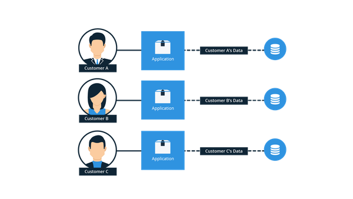
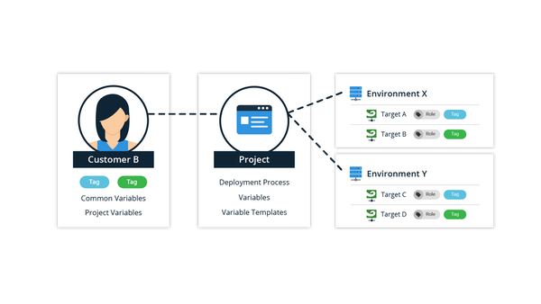
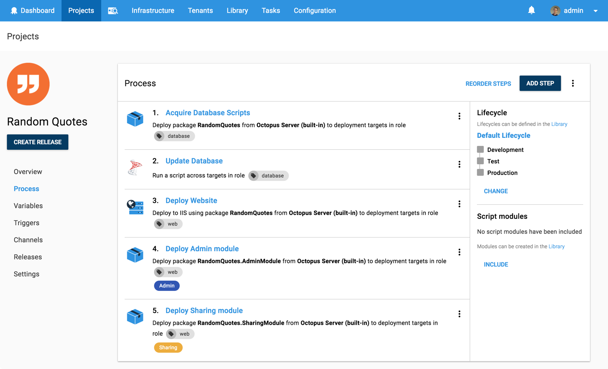
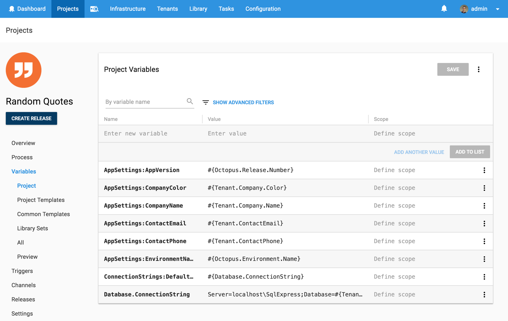
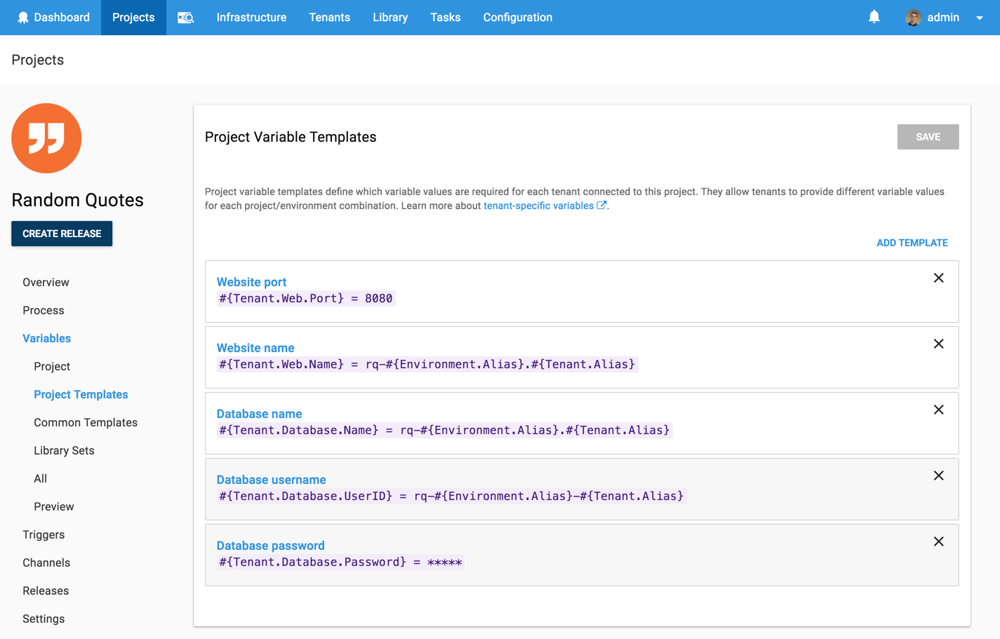
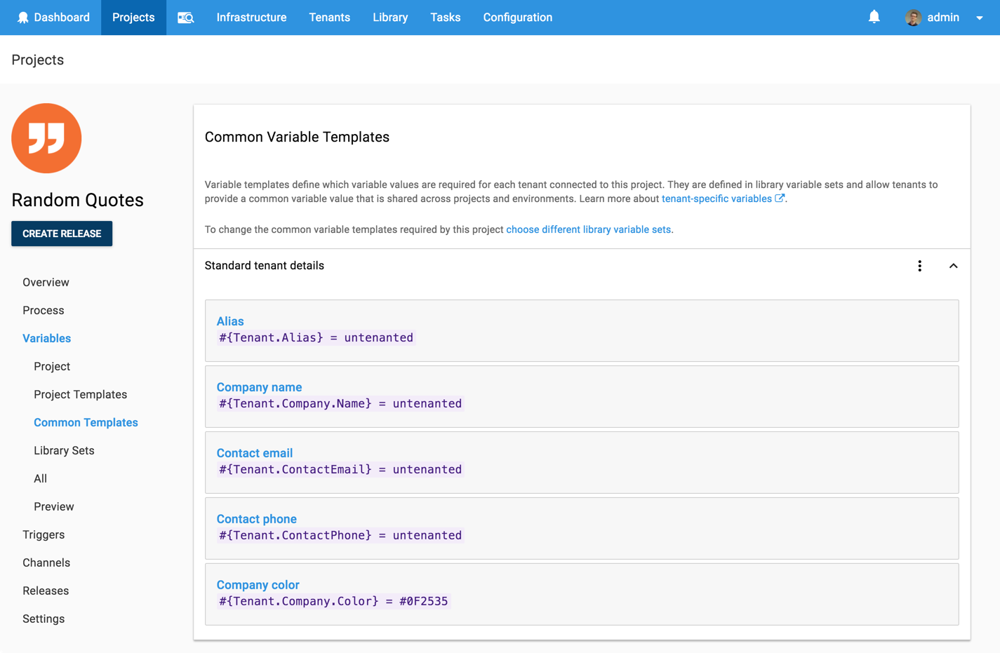

# Deploying a Multi-Tenant Web App to Multiple Customers - Will it Deploy? Episode 5

Will it deploy is a video series where we try to automate the deployment of different technologies with Octopus Deploy. In this special double-episode, we're trying to deploy a multi-tenant SaaS web app to Amazon Web Services (AWS) virtual machines.

## Problem

### Tech Stack

Our app is a quote generator called [Random Quotes](https://github.com/OctopusSamples/WillItDeploy-Episode005). The application is relatively simple but it includes a number of common features that allows us to illustrate the complexities of multi-tenant deployments.

Features:

* Customised app settings for each customer
* Dynamic feature/module loading at application startup
* Customised colors and styles for each customer

Technologies:

* Microsoft [ASP.NET Core 2.0](https://docs.microsoft.com/en-us/aspnet/core/) web app
* [Entity Framework Core 2.0](https://docs.microsoft.com/en-us/ef/core/) framework
* Microsoft [SQL Server 2017](https://www.microsoft.com/en-au/sql-server/) database

Kudos to our marketing manager [Andrew](https://twitter.com/andrewmaherbne) who has been learning to code and built the first cut of this app. Great work! 

### Deployment Target

* AWS - [EC2](https://aws.amazon.com/ec2) virtual machine 
* Microsoft [Windows Server 2016](https://www.microsoft.com/en-au/cloud-platform/windows-server)

## Solution

So will it deploy? **Yes it will!** Our deployment process looks like the following.

Then we add the following steps to successfully deploy our app.

- Octopus **Deploy a Package** step to copy our database scripts to our database deployment target
- Octopus Community Contributed step template -  **[SQL - Execute Script File](https://library.octopusdeploy.com/step-template/actiontemplate-sql-execute-script-file)** to execute our Entity Framework Core migration script agaist our SQL Server database. 
- Octopus **Deploy to IIS** step to deploy our multi-tenant ASP.NET Core web application
- Octopus **Deploy a Package** step to copy the Admin Module to customer's website if they pay for this feature
- Octopus **Deploy a Package** step to copy the Sharing Module to customer's website if they pay for this feature

This project uses the following variables, variable templates and common variable templates to store our app settings, database connection details and web app configuration.

